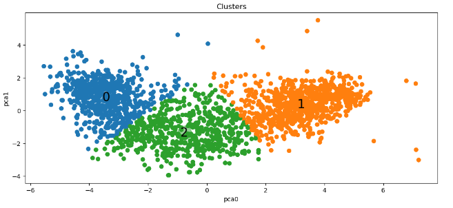

# iFood Data Analysis Case Study

## Overview
As a participant in the iFood hiring process for the role of Data Scientist, the task was to solve the challenge of analyzing customer data and developing predictive models for marketing campaigns. The objective was clear: maximize profit for the next direct marketing campaign while gaining insights into customer behavior.

## Understanding the Problem
iFood, as the leading food delivery app in Brazil, heavily relies on customer engagement for its growth and market dominance. The marketing department faced pressure to optimize its budget and sought a data-driven approach to decision-making. The mission was to build predictive models supporting direct marketing initiatives and proving the value of data-driven strategies.

## Approach
The dataset, containing sociodemographic and firmographic features of 2,240 customers along with labels indicating their response to a pilot marketing campaign, was explored. Thorough exploratory data analysis (EDA) was conducted to identify patterns and insights into customer characteristics and behavior.

Customers were segmented based on their behavior using clustering techniques, providing valuable insights into customer preferences and allowing tailoring of marketing strategies.

Predictive models were built using classification algorithms to identify customers most likely to respond positively to the upcoming marketing campaign, with the goal of maximizing campaign profit while minimizing costs.

## Results:

After conducting thorough analysis and clustering of the customer data, three distinct clusters representing different segments of the customer base were identified. Here are the key characteristics of each cluster:

### Clusters Observation

  

### Cluster 0:
  - Renda baixa
  - Gasto baixo
  - Provavelmente tem filhos
  - Baixa propensão a aceitar campanhas
  - Único cluster com percentagem significativa de pessoas com escolaridade básica
  - Pessoas mais jovens
    
### Cluster 1:
  - Renda intermediária
  - Gasto intermediário
  - Provavelmente tem filhos
  - Podem aceitar campanhas
  - Pessoas com idade mais elevada

### Cluster 2:
  - Renda alta
  - Gasto alto
  - Muito provavelmente não tem filhos
  - Mais propenso a aceitar campanhas
  - Cluster sem pessoas com escolaridade básica
  - Sem perfil de idade que se destaque

### Model Comparison

  

Additionally, aiming at predicting positive or bad responses from campaigns, the logistic regression algorithm was considered the best method. It obtained a mean accuracy of 80%, a ROC AUC of 0.78, and an AUPRC of 0.59 after parameter tuning through gridsearch methods. These insights provide valuable information for targeted marketing strategies. By understanding the distinct characteristics of each customer segment, iFood can tailor its campaigns to effectively engage with different customer groups and maximize campaign success.

## Deliverables
- **Exploratory Data Analysis (EDA):** Detailed analysis and visualization of customer data, providing insights into customer characteristics and behavior.
- **Customer Segmentation:** Identification of distinct customer segments based on behavior, enabling targeted marketing strategies.
- **Predictive Models:** Development of classification models to predict customer response to marketing campaigns, maximizing campaign profitability.

## Conclusion
Participation in this case study provided valuable experience in leveraging data analytics to drive business decisions. By applying advanced analytical techniques, hidden patterns in customer data were uncovered, and actionable strategies to enhance marketing effectiveness were developed. This project showcased the power of data-driven approaches in optimizing marketing campaigns and generating value for the company.

